#### 串行GC
- ###### 串行垃圾收集器，是指使用单线程进行垃圾回收，只有一个线程在工作，一旦进行垃圾回收，应用就会被暂停。
- ###### 如图为串行GC设置xmx与xms分别为512m与1024m的测试情况，发现，同一个时间内内存大了的创建对象更多，并且内存小的出现3次full gc ，而内存大的没有出现。
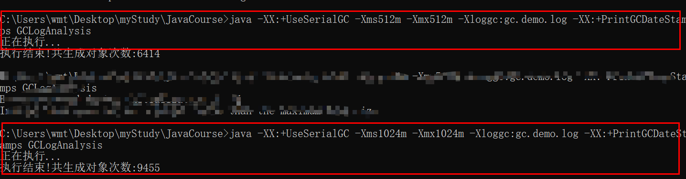
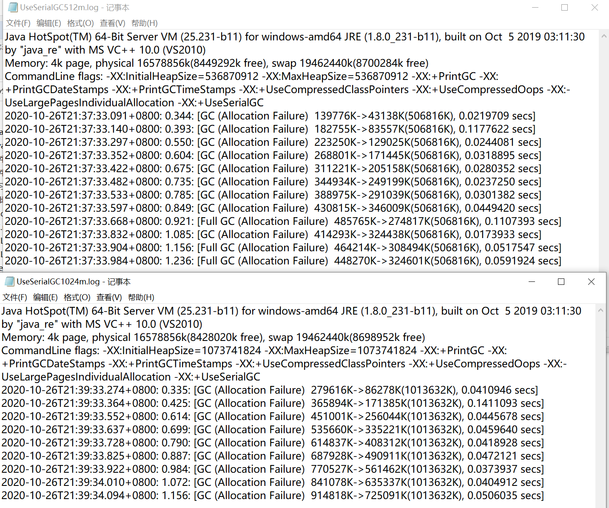
- ###### super benchmarker压测截图，
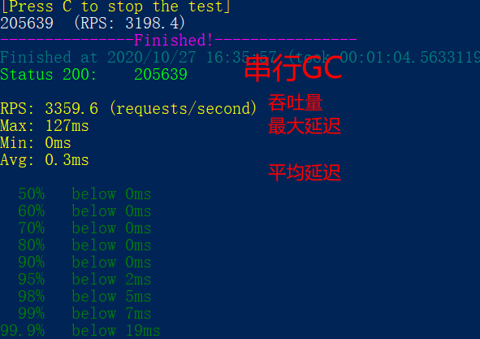
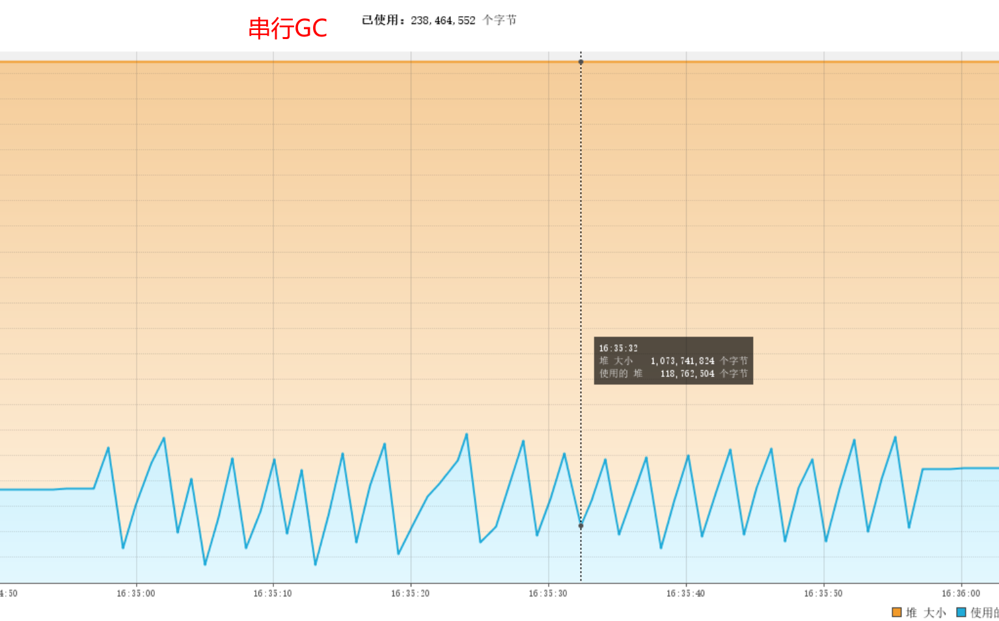
------------------------------------------
#### 并行GC
- ###### 并行GC在串行GC上做了改进，将单线程改为了多线程进行垃圾回收，缩短了GC时间。但是并行GC的过程中也会暂停应用，只是缩短了暂停的时间。
- ###### 如图为并行GC设置xmx与xms分别为512m与1024m的测试情况，发现，同一个时间内内存大了的创建对象更多，并且内存小的GC次数大大多于内存大的，并且发生7-8次fullGC ，而内存大的GC次数相对较少，并且fullGc也只出现了两次。gc日志部分截图如下
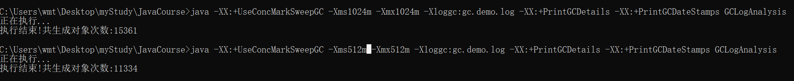
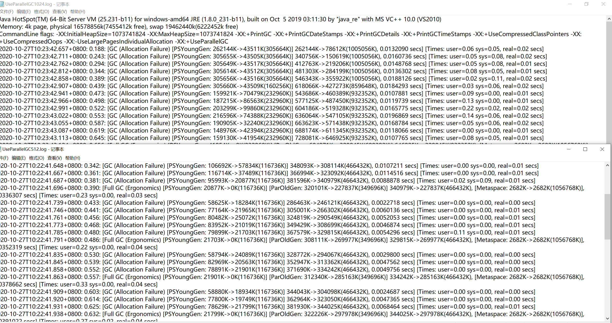
- ###### super benchmarker压测截图，
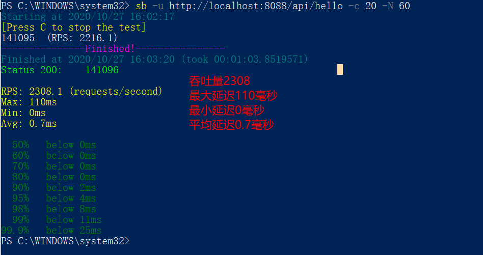
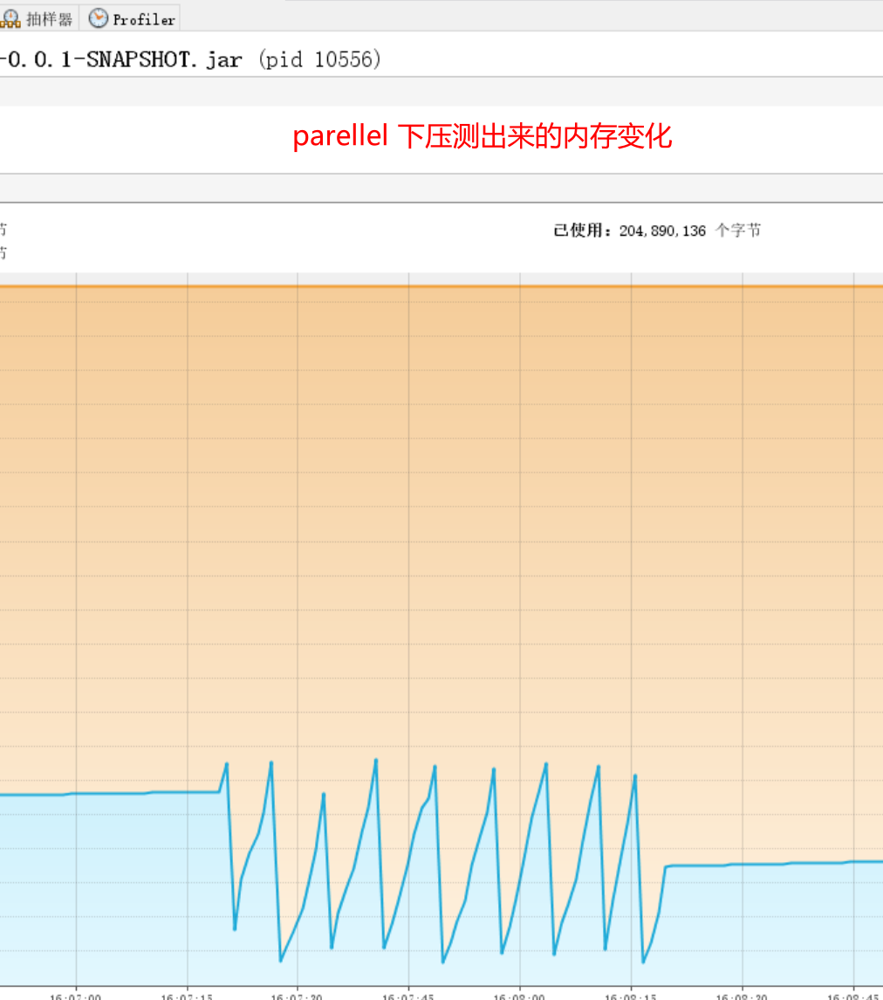

--------------------------------------
#### CMSGC
- ###### CMSGC基于标记-清除算法，也是并发的，在CMS的多个过程中，其只在初始化标记与重新标记的阶段造成stw。这样将stw的时间固定在可接受范围内，但是会产生内存碎片。
- ###### 如图为CMSGC设置xmx与xms分别为512m与1024m的测试情况，发现，同一个时间内内存大了的创建对象更多，并且内存小的cmsGC次数和younggc次数大大多于内存大的。并且cms暂停时间都是差不多的，整体比并行gc小。gc日志部分截图如下
  
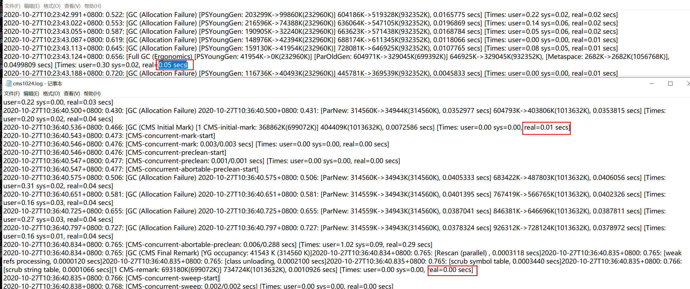
- ###### super benchmarker压测截图，
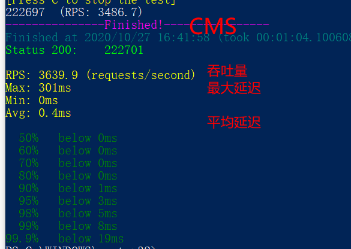
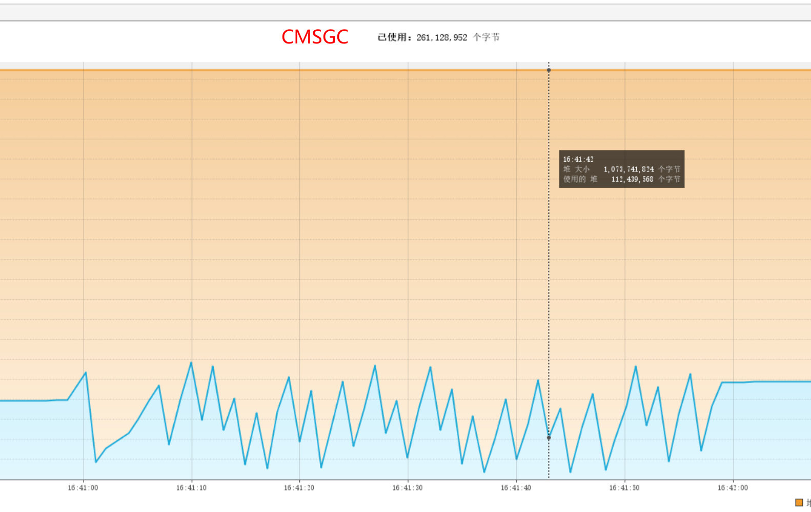

----------------------------------
#### G1GC
- ###### G1相对于其他的垃圾收集器，最大的区别在于他不分代，将堆内存划分为若干个小区域，区域中包含了逻辑上的年轻代和老年代，不用单独的空间对每个代进行设置，也不用担心每个代内存充足与否。年轻代的垃圾回收暂停所有应用线程，将存活对象拷贝到老年代或者survivor区，G1将对象从一个区域复制到另一个区域，完成清理。在处理过程中G1完成了堆的压缩，不会有cms碎片。（如果一个对象占用空间超过分区的50%，那么G1就认为这是一个巨型对象，巨型对象默认放在老年代，但是短期的巨型对象会对GC造成负面影响，所以G1划分了humongous区来存放巨型对象，如果一个区放不下就会分配两个连续的分区，没有的话触发fullgc）
- ###### 如图为G1GC设置xmx与xms分别为512m与1024m和4G的测试情况，发现，同一个时间内内存大了的创建对象更多，并且内存小的cmsGC次数和younggc次数大大多于内存大的。并且G1暂停时间都不长的，整体比并行gc小。这种比较，内存越大越明显。gc日志部分截图如下
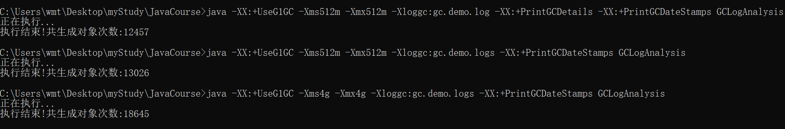
  ###### 4G堆内存的 G1日志只有寥寥几行
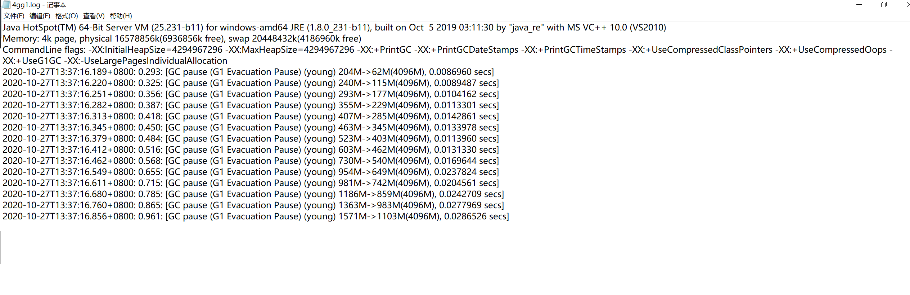
- ###### super benchmarker压测截图，
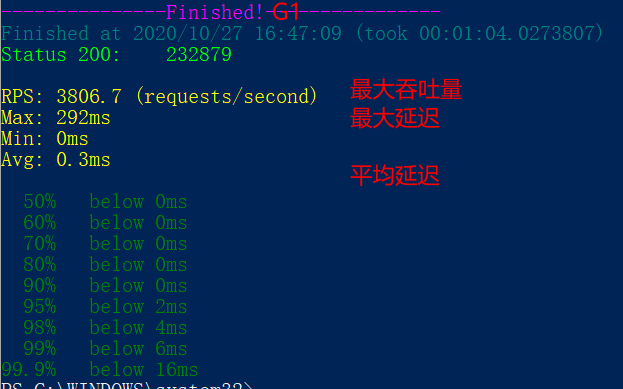
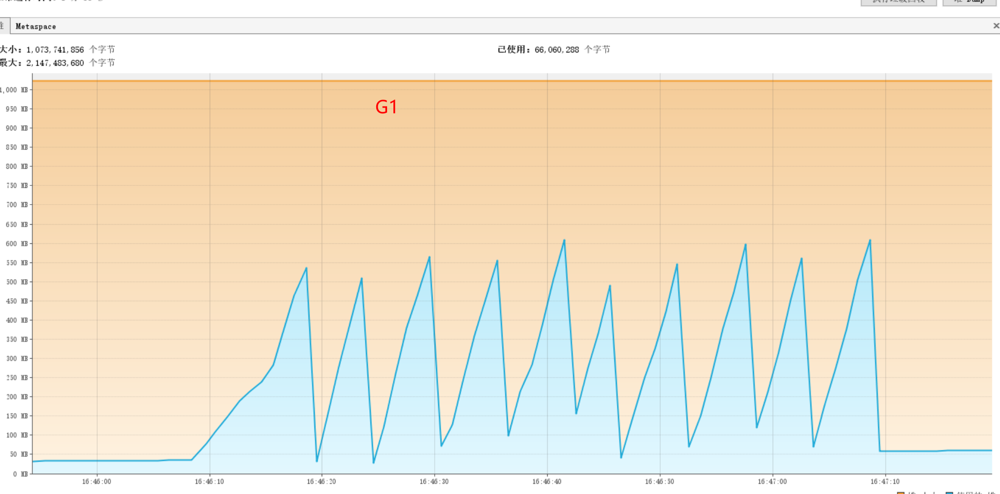
串行|并行|CMS|G1
--|:--:|:--:|--:|
串行GC只有一个线程进行垃圾回收，效率低下，回收停顿时间长，不推荐使用|并行GC优于串行GC，将单线程提升为了多线程，但是相对于CMS G1来说，并行回收，停顿时间也很长，但是吞吐量是最大的，对于只要求吞吐量而不在意卡顿时长的系统可采用并行GC|CMS GC相对于并行GC来说，GC时间可控是他的优点，他将垃圾回收分成了几个阶段，只在初始标记与最终标记阶段进行stw，这也减少了他的卡顿时间。但是CMS GC容易产生内存碎片|G1 GC是java 8以后采用的垃圾收集器，摒弃了之前内存分代的概念，将内存分块，当内存块容量达到一定值进行垃圾回收。他既可以像CMS一样设置stw时间，并且由于他的内存分块，他的暂停时间更低，而且没有CMS一样的内存碎片。
